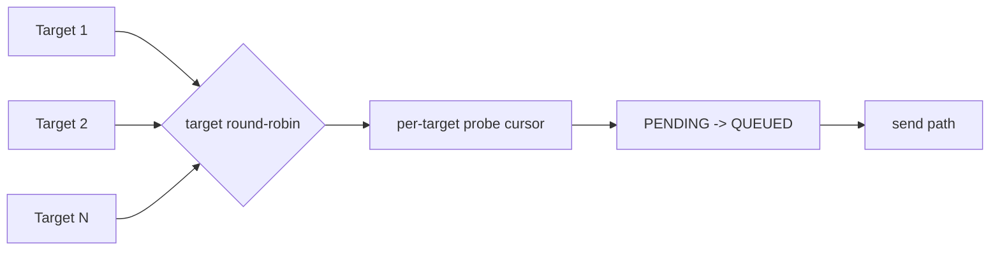
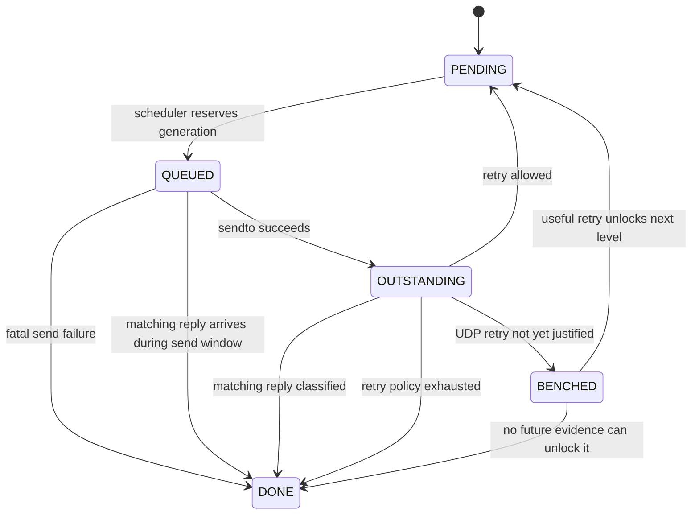

# Architecture

## 1. System overview

`ft_nmap` is built around one poll-driven engine that owns all receive-side decisions. Transmission may be delegated to sender workers, but capture, packet parsing, matching, classification, timeout processing and retry policy remain centralized.

```mermaid
flowchart LR
    CLI[CLI / target file] --> RESOLVE[Target resolution]
    RESOLVE --> ROUTE[Kernel route selection]
    ROUTE --> IFACE[Interface contexts]
    IFACE --> RUNTIME[Per-target runtime]
    RUNTIME --> SCHED[Scheduler]
    SCHED --> SEND[Raw packet send]
    SEND --> NET[(Network)]
    NET --> PCAP[libpcap per interface]
    PCAP --> PARSE[L2 + IPv4/IPv6 parser]
    PARSE --> REPLY[t_nmap_reply]
    REPLY --> MATCH[Probe matching]
    MATCH --> CLASSIFY[Scan classification]
    CLASSIFY --> RUNTIME
```



Primary implementation modules:

- `srcs/engine/prepare.c`
- `srcs/engine/loop.c`
- `srcs/net/route.c`
- `srcs/net/pcap.c`
- `srcs/runtime/scheduler.c`
- `srcs/runtime/worker.c`
- `srcs/runtime/recv.c`
- `srcs/runtime/expire.c`

## 2. Route and interface selection

The scanner does not assume an interface name and does not infer routing from local naming conventions.

For each resolved destination:

1. `find_source_address()` opens a temporary UDP socket in the destination address family.
2. `connect()` lets the kernel perform its normal route lookup.
3. `getsockname()` returns the local source address selected by that route.
4. `find_source_interface()` walks `getifaddrs()` and finds the live interface owning that source address.
5. The resulting interface name and `ifindex` are stored in `t_nmap_route`.

For scoped IPv6 destinations, the expected interface index is also enforced so the same numeric address on another interface cannot be selected accidentally.

This design makes multi-homed hosts a first-class case: two targets may resolve to different outgoing interfaces in the same scan.

```text
Target A ──► kernel routing ──► source address A ──► interface X
Target B ──► kernel routing ──► source address B ──► interface Y
Target C ──► kernel routing ──► source address A ──► interface X
```

### Per-interface resource ownership

Targets that resolve to the same `ifindex` share a `t_nmap_iface_ctx` containing:

- one libpcap capture handle;
- one IPv4 raw send socket, opened on demand;
- one IPv6 raw send socket, opened on demand;
- interface-level in-flight accounting.

The interface context is therefore the ownership boundary for network I/O, while `t_nmap_target_ctx` owns target identity, route and runtime state.

## 3. Engine preparation

`nmap_engine_prepare()` performs the process-level setup before the event loop starts:

- allocate stable target slots;
- resolve each target;
- obtain its kernel-selected route;
- reject duplicate resolved destinations on the same route;
- find or create the matching interface context;
- prepare the required raw socket family;
- prepare one shared capture handle for the interface.

Targets are not given independent capture handles. This avoids duplicating capture work for destinations sharing the same interface and reflects where packets actually enter the process.

## 4. Event loop

The main loop is intentionally ordered around receive correctness:

```text
1. drain captured replies on every active interface
2. expire outstanding probes whose deadline passed
3. archive fully completed targets
4. activate waiting targets when capacity exists
5. schedule eligible probes
6. poll until capture activity, a deadline, pacing eligibility or user input
```

Replies are drained **before** timeout processing. A packet that is already available to libpcap should be considered before the corresponding probe is declared timed out.

Capture draining is bounded per interface, so a saturated interface cannot permanently starve another one.

## 5. Scheduler

The scheduler has two cursors:

- an engine-level target cursor distributes reservations across active targets;
- a target-level probe cursor distributes reservations across that target's probe table.

A successful reservation changes a probe from `PENDING` to `QUEUED` and allocates a new `dispatch_id`. Transmission is a separate step.



### Concurrency policy

The scheduler supports two execution policies because the command line exposes `--speedup` as an explicit behavior choice:

- with sender workers enabled, the worker count is the global number of reserved/outstanding send slots;
- without sender workers, eligibility is controlled by interface capacity and target-local timing, including UDP window and pacing constraints.

This distinction changes **where back-pressure is enforced**, not the scan decision tree. Reply parsing and classification are identical in both modes.

## 6. Sender workers

Workers are deliberately narrow in responsibility. A worker:

1. pops an already-selected `t_nmap_send_job`;
2. validates the job generation against the current probe;
3. builds and sends the raw packet;
4. commits the successful send to `OUTSTANDING`;
5. waits until that probe leaves `OUTSTANDING` before taking another job.

A worker does **not**:

- read libpcap;
- match replies;
- classify port states;
- expire probes;
- choose retries;
- select the next target or probe.

Keeping policy out of sender threads prevents the scan state machine from being split across unrelated execution contexts.

## 7. Probe lifecycle

A logical probe represents one `(destination port, scan type)` pair and survives retransmissions.



### Why `QUEUED` is a real state

A reservation may sit in the sender queue before `sendto()` executes. Treating it as already outstanding would start a timeout too early and would make sender-queue latency indistinguishable from network latency.

### Dispatch generations

`dispatch_id` identifies one reservation generation. A stale queued job cannot act on a probe that has already been completed or re-reserved under a newer generation.

`live_jobs` prevents target runtime storage from being reclaimed until all worker tickets referring to it have retired.

## 8. Timing and retries

Timing policy is stored per target in `t_nmap_timing`.

### TCP timing

When a response corresponds unambiguously to the first transmission, the runtime updates an RTT estimator:

```text
SRTT   <- SRTT + (sample - SRTT) / 8
RTTVAR <- RTTVAR + (|sample - SRTT| - RTTVAR) / 4
RTO    <- SRTT + 4 * RTTVAR
```

Responses recovered only after retransmission are not used as RTT samples. The runtime applies backoff instead, following the same ambiguity principle as Karn's algorithm.

### UDP timing

UDP silence is not equivalent to TCP silence: it can mean an open service that does not reply, packet loss, filtering or ICMP rate limiting.

The runtime therefore tracks separately:

- an UDP in-flight window;
- a minimum inter-probe gap;
- the configured hard retry limit;
- the highest retry level that has actually produced useful evidence.

A silent UDP probe may enter `BENCHED` instead of being retried immediately. It becomes schedulable again only if another response demonstrates that a higher retry level is useful on the same target.

## 9. Receive-side ownership

The main thread owns receive-side state transitions:

```text
libpcap frame
    -> datalink locator
    -> IPv4/IPv6 parser
    -> t_nmap_reply
    -> target selection
    -> probe lookup + full validation
    -> scan classifier
    -> DONE / timing update / bench release
```

This path is detailed in [`PACKET_IO.md`](PACKET_IO.md).

## 10. Architectural invariants

The implementation relies on the following invariants:

- interface names are discovered, never assumed;
- network I/O resources are shared by interface, not duplicated per target;
- a reply is never trusted from source-port identity alone;
- only the main receive path classifies network evidence;
- workers never make scan-policy decisions;
- one logical probe persists across retries;
- a target runtime is not archived while worker jobs can still reference it;
- direct replies and ICMP errors are matched against the route-selected local address as well as the target address.
