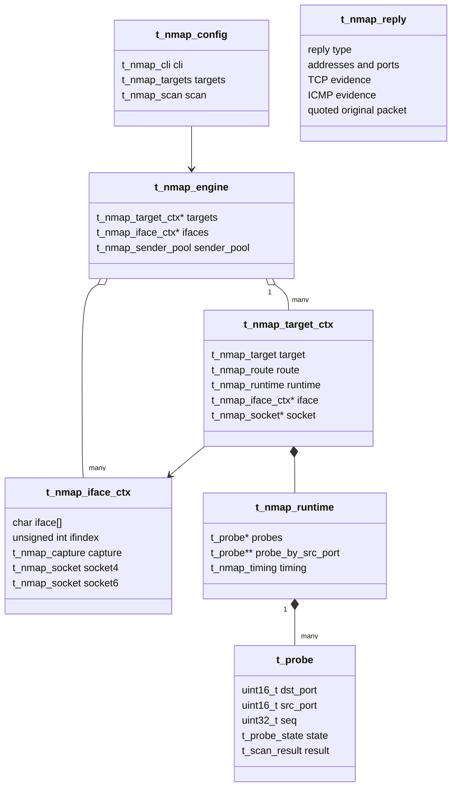

# Data model and ownership

The scanner deliberately separates configuration, route/interface resources, per-target runtime and wire-level reply data.

Definitions live primarily in:

- `inc/config.h`
- `inc/runtime.h`
- `inc/ip_addr.h`
- `srcs/runtime/worker.h`

## 1. Relationship overview



## 2. Address abstraction — `t_nmap_ip_addr`

`t_nmap_ip_addr` is the scanner's protocol-independent address type:

```c
sa_family_t family;
union {
    struct in_addr  v4;
    struct in6_addr v6;
} addr;
uint32_t scope_id;
```

It keeps `sockaddr_in` / `sockaddr_in6` at system-call boundaries instead of spreading address-family casts throughout the runtime.

`scope_id` carries IPv6 zone information when required by scoped addresses.

## 3. Process configuration

### `t_nmap_cli`

Raw command-line intent. It records both values and whether an option was explicitly supplied, allowing normalization to distinguish defaults from user overrides.

### `t_nmap_targets`

Owned list of target strings prepared from `--ip` or `--file`.

### `t_nmap_scan`

Immutable effective scan configuration consumed by the engine:

```text
ports + port_count
scan_mask
thread_count
retries
TCP / UDP timeouts
TTL / Hop Limit
window and UDP pacing limits
output / DNS / OS options
```

### `t_nmap_config`

Process-level aggregate:

```text
t_nmap_config
├── cli
├── targets
└── scan
```

## 4. Target identity and route

### `t_nmap_target`

Resolved destination identity:

- original target name;
- normalized IPv4/IPv6 address;
- textual address cache;
- optional reverse-resolved hostname;
- observed TTL/Hop Limit evidence used by the lightweight OS heuristic.

### `t_nmap_route`

Route chosen by the kernel for that destination:

- interface name;
- interface index;
- local source address;
- textual source address.

The route is per target. The interface resources referenced by that route are shared.

## 5. Interface-owned I/O

### `t_nmap_capture`

libpcap state owned by the interface context:

```text
pcap_t *handle
capture error buffer
selectable fd
datalink type
```

### `t_nmap_socket`

One raw send socket for one address family.

### `t_nmap_iface_ctx`

Network-resource owner for one discovered interface:

```text
interface name / ifindex
libpcap capture
IPv4 raw socket
IPv6 raw socket
adaptive interface window
active target count
atomic in-flight job count
```

Multiple targets point to the same `t_nmap_iface_ctx` when the kernel routes them through the same interface.

## 6. Per-target execution context

### `t_nmap_target_ctx`

The target context joins immutable scan configuration to mutable execution state:

```text
target identity
selected route
runtime probe table
pointer to shared interface context
pointer to selected raw socket
pointer to immutable scan configuration
pointer to engine
lifecycle status
probe round-robin cursor
worker live-job count
start/finish timestamps
```

The target context is the object passed through most runtime operations.

## 7. Probe representation

### `t_probe`

One logical probe represents one destination port and one scan type.

Important fields:

| Field | Role |
|---|---|
| `dst_port` | scanned destination port |
| `src_port` | unique lookup key inside the target runtime |
| `seq` | TCP probe identity; also used in validation when ICMP quotes it |
| `scan_type` | SYN/NULL/FIN/XMAS/ACK/UDP |
| `sent_at_ms` | timestamp of latest successful transmission |
| `deadline_ms` | expiration of the current transmission |
| `attempts_sent` | transmission count for this logical probe |
| `dispatch_id` | current reservation generation |
| `sending_dispatch_id` | transient worker send token |
| `state` | PENDING/QUEUED/OUTSTANDING/BENCHED/DONE |
| `result` | final semantic port state |
| `reason` | structured evidence retained for reporting |

Retries reuse the same object rather than creating new probe records.

## 8. Runtime container

### `t_nmap_runtime`

Mutable state for one active target:

```text
probe array
source-port -> probe index
probe_count
state counters
UDP state counters
source_port_base
last_udp_sent_ms
adaptive timing state
mutex + condition variable
```

`probe_by_src_port` contains 65,536 pointers so the destination port of a direct reply, or quoted original source port of an ICMP error, can select a candidate in O(1).

The candidate is always fully validated afterwards.

## 9. Timing state

### `t_nmap_timing`

Target-local timing/congestion state:

```text
SRTT / RTTVAR / RTO
RTO min/max
UDP window min/current/max
UDP pacing gap and ceiling
clean-reply / rate-limit evidence counters
configured UDP retry ceiling
highest useful retry level observed
```

This state contains learned runtime behavior. `t_nmap_scan` remains the immutable configured policy.

## 10. Normalized network reply

### `t_nmap_reply`

`packet/parse.c` converts raw capture bytes into this structure before runtime matching.

Direct reply fields include:

```text
type
outer TTL/Hop Limit
source/destination address
source/destination port
TCP flags / seq / ack
```

ICMP fields additionally include:

```text
ICMP type/code
original protocol
original source/destination address
original source/destination port
original TCP sequence when quoted
```

The runtime therefore does not need to know where those values were located in Ethernet, IPv4, IPv6, TCP or ICMP byte streams.

## 11. Evidence retained for output

### `t_scan_reason`

A completed probe stores structured evidence instead of preformatted text:

```text
reason kind
address family
TCP flags
ICMP type/code
```

Reporting code is responsible for rendering that evidence for `--reason`.

This keeps presentation decisions out of the runtime state machine.

## 12. Engine-level ownership

### `t_nmap_engine`

The engine owns process-wide execution resources:

- target-context array;
- interface-context array;
- scheduling cursors;
- active/completed/failure counters;
- global in-flight counter;
- sender pool;
- process start timestamp.

Target slots remain stable during execution so worker jobs can safely hold `t_nmap_target_ctx *` pointers. Runtime storage is archived only after the target is complete and `live_jobs == 0`.

## 13. Sender pool types

### `t_nmap_send_job`

Immutable queue ticket:

```text
target context pointer
probe pointer
dispatch generation
```

### `t_nmap_sender_pool`

Shared producer/consumer queue:

```text
worker array
bounded job ring queue
queue cursors/count
mutex + condition variable
stop flag
fatal send-error flag
```

### `t_nmap_worker`

Minimal worker identity:

```text
pthread_t
engine pointer
worker id
started flag
```

Workers do not own scan policy or capture state.
