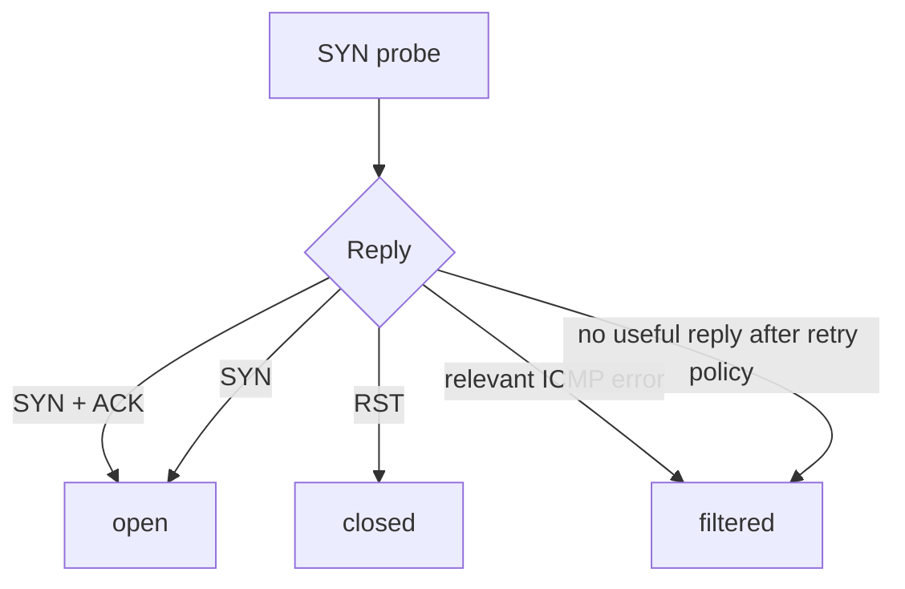

# Scan semantics

This document describes the purpose of each implemented scan and the exact evidence used by `ft_nmap` to produce a port state.

Classification is implemented in `srcs/runtime/classify.c`. Probe flags are built in `srcs/packet/tcp.c` and `srcs/packet/udp.c`.

## 1. Result vocabulary

`ft_nmap` exposes the following semantic states:

- `open`
- `closed`
- `filtered`
- `unfiltered`
- `open|filtered`

`unknown` exists internally while a probe has not yet produced a final result.

## 2. Summary

| Scan | Probe | Positive reply | Rejection | No useful reply |
|---|---|---|---|---|
| SYN | TCP `SYN` | `SYN/ACK` or accepted split `SYN` -> `open` | `RST` -> `closed` | `filtered` |
| ACK | TCP `ACK` | `RST` -> `unfiltered` | filtering ICMP -> `filtered` | `filtered` |
| NULL | TCP, no flags | — | `RST` -> `closed` | `open|filtered` |
| FIN | TCP `FIN` | — | `RST` -> `closed` | `open|filtered` |
| XMAS | TCP `FIN|PSH|URG` | — | `RST` -> `closed` | `open|filtered` |
| UDP | empty UDP datagram | UDP reply -> `open` | target port-unreachable -> `closed` | `open|filtered` |

Filtering/unreachable ICMP evidence is handled explicitly for both IPv4 and IPv6.

## 3. SYN scan

### Purpose

SYN is the primary TCP port-state scan. It asks the remote TCP stack to begin a connection without completing a normal application connection.

### Probe

```text
TCP flags: SYN
```

### Classification



The implementation also accepts a bare `SYN` as open evidence to keep split-handshake support explicit.

## 4. ACK scan

### Purpose

ACK is a **reachability/filtering** scan, not an open-port detector.

If an unsolicited ACK reaches a normal remote TCP stack, a reset is useful evidence that the packet was not silently blocked before reaching that stack. Therefore the meaningful positive state is `unfiltered`, not `open` or `closed`.

### Probe

```text
TCP flags: ACK
```

### Classification

```text
RST                 -> unfiltered
relevant ICMP error -> filtered
silence             -> filtered
```

An ACK scan cannot determine whether the application port is listening.

## 5. NULL, FIN and XMAS scans

These scans use unusual TCP flag combinations to obtain a different signal from a closed TCP port.

### Probes

```text
NULL : no TCP flags
FIN  : FIN
XMAS : FIN | PSH | URG
```

### Purpose

For these scans, a reset is strong negative evidence: the scanner can classify the port as `closed`.

Silence is ambiguous. It may be caused by an open port ignoring the probe or by filtering, so the result is `open|filtered`.

### Classification

```text
RST                 -> closed
relevant ICMP error -> filtered
silence             -> open|filtered
```

The three scans share the same decision tree; only the transmitted TCP flags differ.

## 6. UDP scan

### Probe

The generic UDP implementation sends an empty datagram:

```text
UDP source port      = probe source port
UDP destination port = scanned port
UDP payload length   = 0
```

### Purpose

UDP has no connection handshake. The scanner therefore interprets evidence differently from TCP:

- a direct UDP reply proves that a UDP endpoint answered;
- an explicit port-unreachable error from the target proves that the port is closed;
- silence is ambiguous and becomes `open|filtered` after retry policy.

### Classification

```mermaid
flowchart TD
    A[UDP probe] --> B{Reply}
    B -->|direct UDP reply| O[open]
    B -->|target ICMP port unreachable| C[closed]
    B -->|other relevant unreachable/filtering ICMP| F[filtered]
    B -->|no useful reply after retry policy| OF[open|filtered]
```

## 7. ICMPv4 evidence

The parser accepts ICMPv4 Destination Unreachable (`type 3`) and Time Exceeded (`type 11`) when the embedded original packet can be matched to a probe.

Classification recognizes Destination Unreachable codes:

```text
0, 1, 2, 3, 9, 10, 13
```

For UDP, `type 3 / code 3` is `closed` **only when the ICMP packet comes from the target itself**. A router or firewall may legitimately quote the same original probe, but that is path/filtering evidence rather than proof that the destination UDP port is closed.

Time Exceeded is treated as filtered/path evidence for the scan.

## 8. ICMPv6 evidence

The parser accepts ICMPv6 error messages and keeps the original IPv6 packet quoted inside them.

The classifier currently uses:

- Destination Unreachable (`type 1`, codes `0..6`);
- Time Exceeded (`type 3`, codes `0..1`).

For UDP, `type 1 / code 4` from the target itself means `closed`. Other recognized unreachable results are `filtered`.

Packet Too Big and Parameter Problem are parsed as ICMPv6 errors but are not used as port-state evidence by the current classifier.

## 9. Why the original packet matters

An ICMP error does not necessarily come from the target. It may come from an intermediate router or firewall.

For this reason `ft_nmap` does **not** identify an ICMP reply from the outer source address alone. It matches the quoted original packet:

```text
outer IP
└── ICMP / ICMPv6
    └── original IP header
        └── beginning of original TCP/UDP header
```

The embedded source/destination addresses, transport protocol and ports identify the probe that triggered the error. TCP sequence information is also checked when the quotation includes it.

The byte-level format is documented in [`PACKET_IO.md`](PACKET_IO.md).

## 10. State interpretation boundaries

The state is a statement about the evidence obtained by **this scan technique**, not a global truth about the service.

Examples:

- `ACK -> unfiltered` says the traffic reached a TCP stack; it does not say the port is open.
- `NULL/FIN/XMAS -> open|filtered` says silence cannot distinguish the two possibilities.
- `UDP -> open|filtered` says the absence of a reply is not sufficient to conclude either state.

This distinction is preserved in the runtime rather than flattened into a generic success/failure result.
